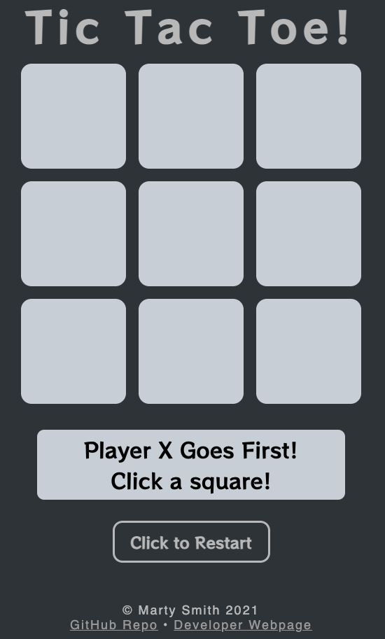
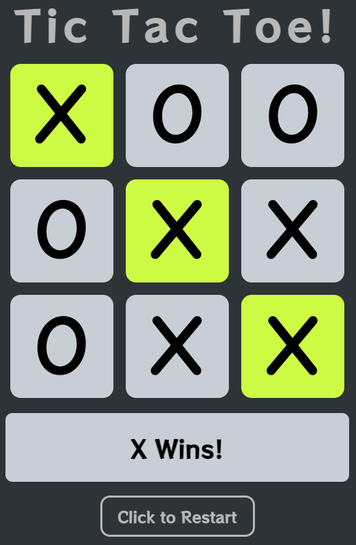
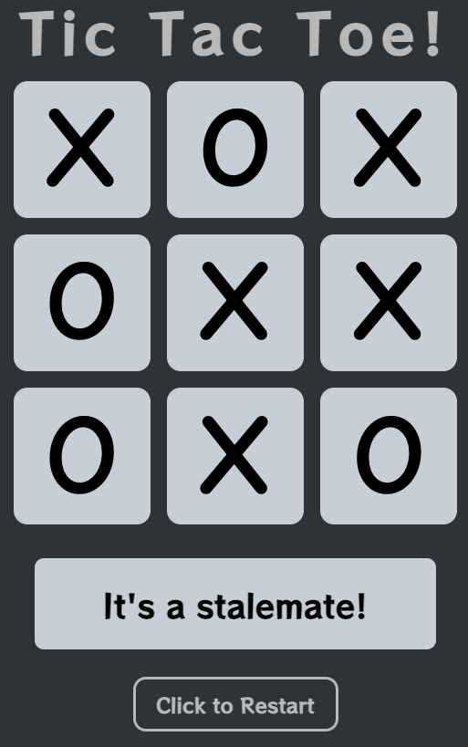

# Introduction

This app is an example of the classic game Tic-Tac-Toe, created as a deliverable for the Software Engineering Immersive program with General Assembly.  Click [here](https://mhsmith321.github.io/GA-tic-tac-toe/) to play right now!

# Table of Contents

1. [Instructions for Use](#instructions)
2. [Version Notes](#version-notes)
3. [Tech Framework](#tech-framework)
4. [Manifest.json](#manifest)
5. [Future Plans](#future-plans)
6. [Contribute](#contribute)
7. [Special Thanks](#special-thanks)
8. [Appendices](#appendices)
   1. [Appendix A: Unit 1 Project Assignment from General Assembly](#appendix-a-assignment)
   2. [Appendix B: Product Screenshots & Images](#appendix-b-pictures)

[Back to Top](#top)

# Instructions for Use

The game loads with 9 grey boxes.  Two people will take turns clicking squares until one person has claimed three squares forming a straight line and wins.  The line may be horizontal, vertical, or diagonal.  At this point the game will inform both players that the game has been won and will become non-interactable.  The game also ends if all nine squares are claimed without either player able to select three squares in a row.  In this case the players will be informed they have reached a stalemate.

During gameplay, if a square is free for the current player to claim it will turn orange when hovered over with the cursor.  When clicked it will mark the square as claimed with either an **X** or **O** depending on the current player.

At any point during or after play, players may click the marked reset box to start a new game.

[Back to Top](#top)

# Version Notes

The version **1.1.7.4** of this app is currently uploaded and live.  In cases where I update the README without any updates to the website itself I do not update the version number or use branches for my work.  Each version number will lack a commit number until the next version is uploaded.  The current commit number is always added retroactively.  In general, for version number format X.Y.Z:
* X: increases in this number represent a complete overhaul of some section of the website, source code, or UI
* Y: increases in this number represent a major functional change/aesthetic change or addition to the app
* Z: increases in this number represent changes that are relatively minor but still warrant a new commit

Versions prior to 1.0.0 are pre-deployment and will have varying levels of functionality.  If you are looking for a functioning version of the app be sure to fork from versions 1.0.0 and later.

#### v 0.0.1 | 01 March 2021 | commit d8124362bfe6f1de7633ab44e92cf86d0dff3601 | Initial Commit
* Set up boilerplate HTML in `index.html`.
* Linked `styles.css` and `scripts.js` to `index.html`.

#### v 0.0.2 | 04 March 2021 | commit 71673c3da2998ed3069ae2bbb394213d942126ca
* Wireframe is rendered with basic functionality.

#### v 0.0.3 | 05 March 2021 | commit c8b00dec238d3512121ebc07d9b53f89cde61ad0
* Game has full functionality completed.

#### v 0.0.4 | 05 March 2021 | commit f1ba47d3b19a51bb5524eba33bf4afeb2ae05733
* I refactored players from `red`/`green` to `1`/`2`.  Easier to code this way.  I initially used `red`/`green` because clicked boxes were color-coded but I don't like this aesthetic now that I see it.

#### v 0.0.5 | 05 March 2021 | commit c7095df9ad6a933f094e72b984d9dd1e96cfd102
* Clicks on game tiles now render *X* or *O* depending on player turn.

#### v 0.0.6 | 05 March 2021 | commit 81b90c44739cd92313916b73d7c19a9b95c53ce9
* Game squares now highlight orange when hovered over.  This is why I stopped color-coding clicked boxes to indicate player selections.

#### v 1.0.0 | 05 March 2021 | commit db0cf09e4f3e909e9d227bd55e46dbf82f169023
* Added a textbox that shows instructions and declares a winner or stalemate when appropriate.

#### v 1.1.0 | 28 May 2021 | commit 08e76675a730a418c2dd28f105fe98c2b0e4da1f
* Cleaned out unnecessary `console.log()` statements from `index.html` left over from testing.
* Centered game horizontally and vertically in the browser.
* Added `<header>` and `<footer>` sections.
* Reduced game board size to make room for `<header>` and `<footer>` sections.
* Built a button to restart the game.
* Refactored `function declareWinner()` to use a ternary rather than an `if/else` statement.
* Fully built-out `README.md` file.

#### v 1.1.1 | 28 May 2021 | commit 929fc50d1b4bce263b497d84c4710156bc7b7ba8
* Fixed a hyperlink in `<footer>` which previously redirected to the wrong GitHub repository.

#### v 1.1.2 | 30 May 2021 | commit 47ab61b9c687a6a0cc12f8390b25ae86a41f7609
* Fixed a bug where the game remains interactable after declaring a winner.
* Refactored `function renderGame()` and `function renderGameDivs()` to de-spaghettify.

#### v 1.1.3 | 30 May 2021 | commit 7e5e87f97f419f8d03e3e4ff054f9dc392780d99
* Fixed versioning error in `README.md` on previous commit.
* Renamed `function checkWin()` to to `function checkEndGame()`.
* Refactored `function checkEndGame()` to use `.forEach` HOF instead of for-loops.
* Refactored `function checkEndGame()` and `function checkForWinner()` to remove `if/else` trees.  Now the function can be called on either player in its native state.  Previously half the code wouldn't run.
* Refactored argument `color` as `player` in `function declareWinner()`;

#### v 1.1.4 | 30 May 2021 | commit 309198d3c5ba71737fc20bc240e80524439b3823
* Universal refactor of value `'p1'` to `'player'1` and `'p2'` to `'player2'`.
* Refactor `function handleClick()` to remove spaghetti.  Now it launches a series of functions to process a player move and evaluate if endgame has been reached.
* Moved images for `README.md` from `/images` directory to `/images/readme-images`.  Updated image filepaths in `README.md` accordingly.
* Added `manifest.json` to store metadata and link in `<head>` of `index.html` file.
* Created and added a favicon.

#### v 1.1.5 | 31 May 2021 | commit 83d4a73c24d6fd0472b5b1cd5b98b6e3e0e19494
* Fixed bug in CSS that allowed `<header>` and `<footer>` containers to overrun `<main>` container.

#### v 1.1.6 | 31 May 2021 | commit 760504554177184306b9ed97403ca924fc947574
* Winning square get a green background when the game is won.
* Fixed bug that allowed a square to be clicked and claimed multiple times by different players.  Now once a square is clicked its event listener is removed.
* Refactored code to add CSS classes to HTML elements via `element.classList.add()` rather than by string concatenation.
* Removed a number of icebox features still listed in [Future Plans](#future-plans) section of this `README.md` file which have been implemented.

#### v 1.1.7 | 31 May 2021 | commit ed6402c22affc5f49f7c1bec3b2d52dbb51b5e2c
* Changed CSS classes so that background color highlighting on mouse hover is only active for unclaimed boxes.  JavaScript now removes class `unclaimed` and replaces it with `p1-box` or `p2-box` on click.

#### v 1.1.7.1 | 31 May 2021 | commit 801b97827fec45196e5965f269b3d21d8ce6d1fe
* Removed dead code inadvertently left commented-out.

#### v 1.1.7.2 | 31 May 2021 | commit f5fd43bcde768708b12d39f7bb7b20306b7a6819
* Relocate `function resetGame()` from *Structural Functions* to *Event Listeners* section of code.
* Add comments to `scripts.js` file to better show code organization.

#### v 1.1.7.3 | 01 June 2021 | commit 6358aaed119a2caccda8a596a792f16f3bd2fdc7
* Updated `README.md` screenshot for game victory with new highlighting on winning squares.
* Fixed a bug causing `manifest.json` and favicon to not load on the deployed app.

#### 1.1.7.4 | 30 June 2021 | commit TBD | Current Version
* Fixed typos in filepaths linking images in this `README.md` file.

[Back to Top](#top)

# Tech Framework

**This app uses:**
* HTML5 and CSS3
* JavaScript ES6

**I built this app with:**
* [VSCode](https://code.visualstudio.com/) version 1.53.2
* [Google Chrome](https://www.google.com/chrome/) version 88.0.4324.192 (Official Build) (arm64)
* [Homebrew](https://brew.sh/) 3.0.2
* Zsh 5.8 with [Oh My Zsh](https://ohmyz.sh/)
* [GitHub](https://github.com/) (online, not desktop)
* macOS Big Sur version 11.2.1, Apple M1 chip

**This app is hosted at:**
* [GitHub Repo](https://github.com/mhsmith321/GA-tic-tac-toe)
* [GitHub Hosted Site](https://mhsmith321.github.io/GA-tic-tac-toe/)

[Back to Top](#top)

# Manifest.json

Manifest.json is a new technology, still experimental at the time of me writing this, and was developed per [MDN guidelines](https://developer.mozilla.org/en-US/docs/Mozilla/Add-ons/WebExtensions/manifest.json).  This file isn't wholly necessary for the function of this app but is important for future-proofing and good practice.

Here are some notes about this file:
* The keys `"name"`, `"manifest-version"`, and `"version"` are mandatory.  All others are optional and included as I see them relevant to his app.
* The key `"manifest-version"` must always be set to `2` (datatype integer).  This is in the requirements as specified in MDN docs.  Presumably this is still an experimental feature and `2` is the value that prevents things from breaking.
* The `"version"` key will be updated at any time I push a new version of this app.  All other keys will likely never change.
* I'm unlikely to add more keys unless I develop this app to exist outside of a GitHub hosted site or more keys are published for use.
* All keys must be entered as a string.
* Double-quotes only; single-quotes will not be recognized.
* As far as I am aware there is no way to insert inline notes.
* Favicons still need to be linked in the `<head>` of `<index.html>` although the manifest lists them with correct locations.  Listing them in the manifest is a future-proofing measure.

[Back to Top](#top)

# Future Plans

* *Important!* Before using CSS `:hover` to highlight squares which are available for selection I tried using event handlers `onmouseover` and on `mouseout`.  It was a nightmare.  *Do not* attempt to refactor in this way unless the refactor also involves implementing jQuery which handles these events more easily.
* Figure out why favicon appear on my local machine but not on my GitHub-hosted site.
* Refactor game squares and restart button as `<button>` elements.  This will improve accessibility.
* Work on better separation of concerns in `scripts.js` file.
* Create a tournament mode that tracks best-of-3/5/7 games.

[Back to Top](#top)

# Contribute

Although I'm always interested in meeting new collaborators I prefer to keep this an individual project as a skills demonstrator.

I'm happy to let anyone reuse my code so long as you contact me for advance permission and give attribution where appropriate.  Some materials are specified in this README as proprietary material from General Assembly and should only be used with the direct permission of General Assembly.

If you'd like to learn more about the developer, please visit [my website](https://martysmith.tech/) and [my GitHub](https://github.com/mhsmith321).

[Back to Top](#top)

# Special Thanks

* Instructors and peers from the General Assembly SEIR-EC-2-22 cohort for collaboration in developing this app. While this app represents my own original work we gave each other assistance in developing our own versions thereof.
* The `X` and `O` characters use the [Comic Neue](http://comicneue.com/) font which I found with [Google Fonts](https://fonts.google.com/).  It was designed by [Craig Rozynski](https://github.com/crozynski/) and made available under the [SIL Open Font License](https://scripts.sil.org/cms/scripts/page.php?site_id=nrsi&id=OFL). 
* The text box uses the [RocknRoll One](https://github.com/fontworks-fonts/RocknRoll) font which I found with [Google Fonts](https://fonts.google.com/).  It was designed by [Fontworks, Inc](https://github.com/fontworks-fonts) and made available under the [SIL Open Font License](https://scripts.sil.org/cms/scripts/page.php?site_id=nrsi&id=OFL).
* Creating a favicon was easy using [favicon.io](https://favicon.io/), a free resource created by [John Sorrentino](https://twitter.com/johnsorrentino).

[Back to Top](#top)

# Appendices

## Appendix A: Unit 1 Project Assignment from General Assembly

### Objective

This assignment is a deliverable! Turn it in to the appropriate pinned thread in Slack before the start of class on March 5, 2021.

Build a Tic-Tac-Toe game incorporating the web technologies and techniques you’ve worked with thus far:

- HTML
- CSS
- JavaScript
- DOM Manipulation

### Minimum Requirements

- Display an empty tic-tac-toe board when the page is initially displayed.
- A player can click on the nine cells to make a move.
- Every click will alternate between marking an `X` and `O`.
- Once occupied with an `X` or `O`, the cell cannot be played again.
- Provide a `Reset Game` button that will clear the contents of the board.

### Getting Started / Hints

- **Follow the approach as described in the *Guide on How to Build a Browser Game***.
- Fork & clone the starter [code repository](https://github.com/SEI-Remote/ttt-weekend) by doing the following:
    1. Go into your labs directory (located at **~/code/sei/labs**) ****- ****use the `sei` alias we made to help. 
    2. Fork the ttt-weekend repository to your GitHub account and clone it to your machine with this command:
        `gh repo fork SEI-Remote/ttt-weekend --clone=true`
- Using `id` and/or `class` attributes will help you target elements for styling and wiring up your click event listeners.
- Programs, including games, are frequently focused on manipulating data and displaying that data to a user. Decide on the data structures held in variables you will use to maintain the game’s *state* (data / status).
- Note that the values you use to represent your game state don’t necessarily have to match what you want to display. For example, just because you want to display X and Os doesn’t mean that you have to use those letters in your data structure. You might choose to use 1 to represent player X and -1 to represent player O, for example. Then, in your *render* function, you would have the logic to translate data to what you want to display.
- Wire up your click event listener(s). Using a single listener with event bubbling is recommended but not required.
- Lots of little functions!

### Pseudocode

Pseudocode is a detailed description of what an application must do, written in natural language instead of a particular programming language.

Well-written pseudocode should be easily translated into actual code.

The best way to get started is to start with the “big picture” of what the app needs to do:

1. Define the required constants
2. Define the required variables used to track the state of the game
3. Store elements on the page that will be accessed in code more than once in variables to make code more concise, readable, and performant.
4. Upon loading, the app should:
    1. Initialize the state variables
    2. Render those values to the page
    3. Wait for the user to click a square
5. Handle a player clicking a square
6. Handle a player clicking the replay button

Since most web apps are event-driven by nature. Coding an event-driven program generally requires that we set up the application when it loads (steps 1 - 4) and wait for the user to interact with the app (steps 5 & 6).

Now we can start adding as many detailed steps as desired.

Typically, pseudocode does not have to be as detailed as the following - it is highly detailed here to help you as much as possible:

1. Define the required constants:
   1. Define a colors object with keys of 'null' (when the square is empty) and players 1 & -1. The value assigned to each key represents the color to display for an empty square (null), player 1, and player -1.
   2. Define the 8 possible winning combinations, each containing three indexes of the board that make a winner if they hold the same player value.
2. Define the required variables used to track the state of the game:
   1. Use a board array to represent the squares.    
   2. Use a turn variable to remember whose turn it is.
   3. Use a winner variable to represent three different possibilities - a player that won, a tie, or a game in play.
3. Store elements on the page that will be accessed in code more than once in variables to make code more concise, readable, and performant:
   1. Store the 9 elements that represent the squares on the page.
   2. Store the element that displays the game status on the page.
4. Upon loading, the app should:
   1. Initialize the state variables:
      1. Initialize the board array to 9 nulls to represent empty squares. The 9 elements will "map" to each square, where index 0 maps to the top-left square and index 8 maps to the bottom-right square.
      2. Initialize whose turn it is to 1 (player 'X'). Player 'O' will be represented by -1.
      3. Initialize winner to null to represent that there is no winner or tie yet. Winner will hold the player value (1 or -1) if there's a winner. Winner will hold a 'T' if there's a tie. 
   2. Render those state variables to the page:
       1. Render the board:
            1. Loop over each of the 9 elements that represent the squares on the page, and for each iteration:
            2. Use the index of the iteration to access the mapped value from the board array.
            3. Set the background color of the current element by using the value as a key on the colors lookup object (constant).
      1. Render a message:
         1. If winner has a value other than null (game still in progress), render whose turn it is - use the color name for the player, converting it to upper case.
         2. If winner is equal to 'T' (tie), render a tie message.
         3. Otherwise, render a congratulatory message to which player has won - use the color name for the player, converting it to uppercase.
   3. Wait for the user to click a square
5. Handle a player clicking a square:
   1. Obtain the index of the square that was clicked by either:
       1. "Extracting" the index from an id assigned to the element in the HTML, or
       2. Looping through the cached square elements using a for loop and breaking out when the current square element equals the event object's target.
   2.  If the board has a value at the index, immediately return because that square is already taken.
   3.  If winner is not null, immediately return because the game is over.
   4.  Update the board array at the index with the value of turn.
   5.  Flip turns by multiplying turn by -1 (flips a 1 to -1, and vice-versa).
   6.  Set the winner variable if there's a winner:
        1. Loop through the each of the winning combination arrays defined.
        2. Total up the three board positions using the three indexes in the current combo.
        3. Convert the total to an absolute value (convert any negative total to positive).
        4. If the total equals 3, we have a winner! Set winner to the board's value at the index specified by the first index in the combo array. Exit the loop.
   7.  If there's no winner, check if there's a tie:
        1. Set winner to 'T' if there are no more nulls in the board array.
   8.  All state has been updated, so render the state to the page (step 4.2).
   9.  Handle a player clicking the replay button:
   10. Add a replay button to the HTML document
   11. Store the new replay button element
   12. Call the function you already built that does steps 4.1 (initialize the state variables) and 4.2 (render).

Using a numbered outline is not required but helps organize the more complex steps into detailed steps.

### Bonuses

- Display whose turn it is (“X” or “O”).
- Provide win logic and display a winning message.
- Provide logic for a cat’s game (tie), also displaying a message.
- Add your personal touch with unique styling.

[Back to Top](#top)

## Appendix B: Product Screenshots & Images

### Game Start Screen

### Game on Player Win

### Game on Stalemate

[Back to Top](#top)